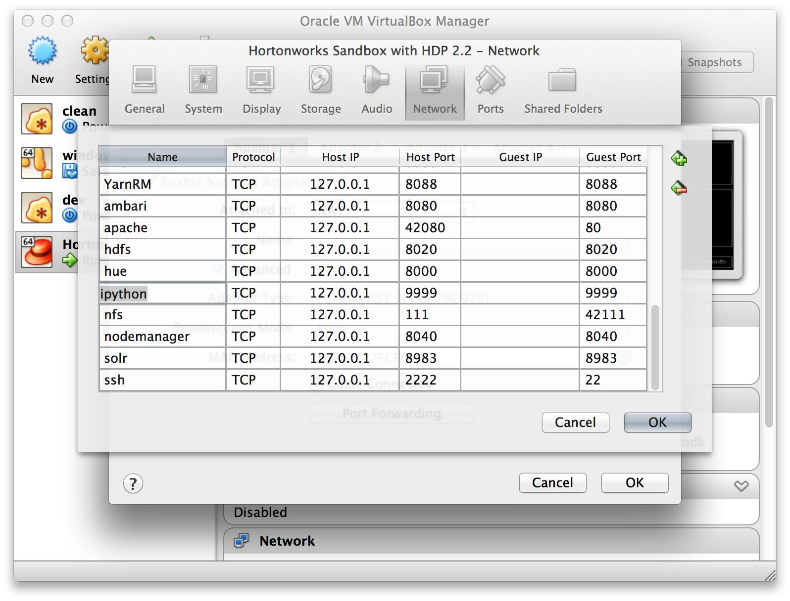
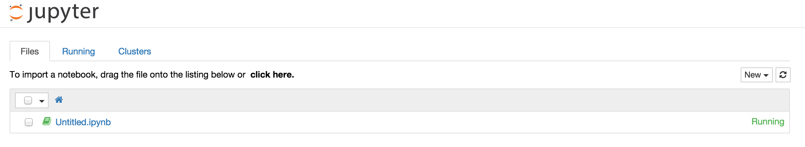
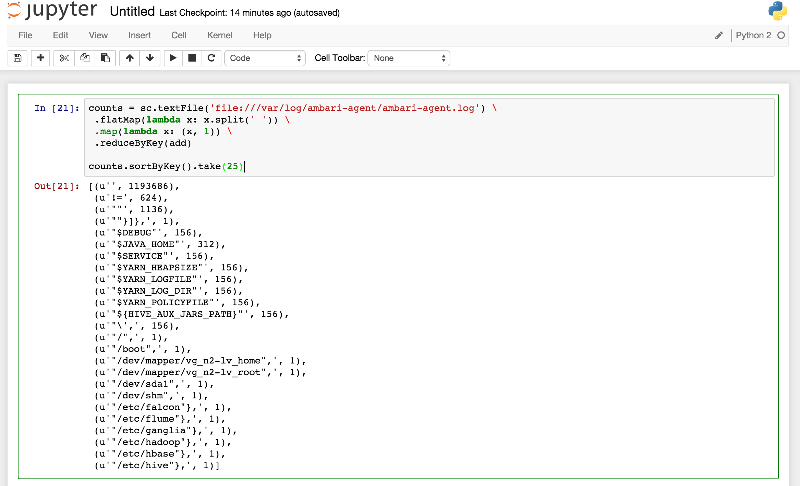

An Ambari Stack service for IPython (Jupyter) Notebook with pre-installed packages for working with data in Hadoop (pydoop, scikit-learn, pandas, numpy, scipy, etc.).

This stack deploys Python 2.7.9 as an altinstall. Make sure you backup any site-packages already installed in /usr/local/lib/python2.7/site-packages.

To enable support for the Spark REPL API, the service downloads and uses a Spark build (~200MB) from dropbox. This will not interfere with existing Spark installs.

To deploy, copy the entire directory into your Ambari stacks folder and restart Ambari:

**Note**: If using the HDP 2.2 Sandbox, add a port forwarding rule for port 9999:

and:
```
sudo service ambari stop
```

**Stack Install Directions:**
```
git clone https://github.com/randerzander/ipython-stack
sudo mv ipython-stack /var/lib/ambari-server/resources/stacks/HDP/2.2/services/
sudo service ambari-server restart
sudo service ambari-agent restart
```

Then you can click on 'Add Service' from the 'Actions' dropdown menu in the bottom left of the Ambari dashboard. When you've completed the install process, IPython Notebook will be available at your_server_host:9999




If you want to remove the IPython service, stop it, then:
```
curl -u $user:$pass -i -H 'X-Requested-By: ambari' -X DELETE http://$host:8080/api/v1/clusters/$cluster/services/IPYTHON
```
A 'remove.sh' script is provided in the project root for convenience. It'll remove the stack package from Ambari's resources as well as clear out /home/ipython.

Special thanks to [Ali Bajwa](https://github.com/abajwa-hw) and [Ofer Mendelevitch](https://github.com/ofermend) for the help with setup and build processes.
